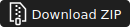

## L's Tweeks
A modular World of Warcraft UI addon for interface adjustments and configurable aura frames.

&nbsp;

## Features
- Buffs & Debuffs module with configurable aura frames.
- Preset frames for static, short, long and de buffs as well as WoW CoolDown Manager (CDM) groups.
- Custom filtered aura frames using AuraFilters such as `HELPFUL|IMPORTANT`.
- Icon or bar presentation modes, growth direction, spacing, width, colors, timers, and test-aura previews.
- Per-frame tooltip visibility.
- Aura Frame Profiles for saving and loading a complete aura-frame setup across characters.
- Optional hiding of Blizzard buff/debuff frames.
- Optional minimap button, open-on-reload setting, and main panel transparency.
- Toggle for portrait combat text.
- Sound Levels module framework for muting known loud sounds and playing quieter addon replacement audio.

&nbsp;

## Manual Installation
Choose a method, either Download or Clone, to install the AddOn.

### Download 
1. Download the repository as a zip file.
    
    1. Click  
    
    1. Click  

1. Extract the zip file which should generate a folder that, with its contents, is the L's Tweeks AddOn.

1. Ensure the addon is in a single folder named `LsTweeks`
    1. This is necessary as some zip file extractors will rename the folder or add extra folders.

1. Place the addon folder into the WoW AddOn directory:  
   `World of Warcraft/_retail_/Interface/AddOns/`

1. Launch the game and enable **L's Tweeks** in the AddOns menu.

### Clone
1. Clone the repository into the AddOns folder directly or to a location of your choice and copy or move into the WoW AddOn directory:  
   `World of Warcraft/_retail_/Interface/AddOns/`

&nbsp;

## Use Notes
- To open the L's Tweeks addon without the minimap button input the Slash Command: `/lst` in the chat wender and press Enter.
- Open the **Buffs & Debuffs** panel for aura frame settings.
- Use **Buffs & Debuffs > Profiles** to save or load complete Aura Frames setups across characters.
- Open the **Settings** panel for minimap, open-on-reload, and interface transparency settings.
- Open the **Sound Levels** panel to configure loud-sound presets after the target sound FileDataIDs and replacement audio files have been added.

&nbsp;

## Aura Frames Reference
Aura frames replace and extend the default buff / debuff display. The module includes preset player-aura frames, WoW Cooldown Manager-backed frames, and custom filtered frames.

### Preset Frames
- `Static`: permanent player buffs.
- `Short`: timed player buffs at or below the short-buff threshold.
- `Long`: timed player buffs above the short-buff threshold.
- `Debuffs`: harmful player auras.

### WoW Cooldown Manager Frames
CDM-backed frames read live Blizzard Cooldown Manager viewer state:

- `Essential`
- `Utility`
- `Tracked Buffs`
- `Tracked Bars`

**NOTE:** WoW Cooldown Manager must stay enabled for these frames to populate. CDM-backed Blizzard viewer frames are hidden with alpha/mouse settings, not `Hide()`, because hidden viewers stop providing useful child state. Use **Sync to CDM** after manually reordering icons inside the same CDM group if the addon frame has not refreshed yet.

Cooldown Viewer categories come from WoW API `Enum.CooldownViewerCategory`.  
Source: https://warcraft.wiki.gg/wiki/Enum.CooldownViewerCategory

### Custom Filtered Frames

Displays the result of selectable combination of filters. e.g.
`HELPFULL | IMPORTAMT`
The displayed ouput result of these combinations isn't fully known yet.

&nbsp;

### Aura Frame Profiles
Profiles save the full Aura Frames setup, including preset frame settings, CDM-backed frame presentation, positions, colors, timer styling, and custom filtered frames. Loading a profile replaces the current Aura Frames setup and recreates missing custom frames. Profile loading is blocked during combat.
The Aura Frames reset panel includes a checked **Keep Profiles** option so saved profiles can survive a module reset.

&nbsp;

## Embedded Libraries
All embedded libraries are stored in `libs/` and documented in `libs/sources.md`.
Libraries are unmodified.
- CallbackHandler
- LibDBIcon
- LibDataBroker
- LibStub

&nbsp;

## License
- This project is released under the MIT License.
- Embedded libraries retain their original licenses as documented in `libs/sources.md`.
- See the `LICENSE` file for full details.
- Copyright (c) 2026 **LockBall**

&nbsp;

## Credits

- LibStub, CallbackHandler-1.0, LibDataBroker-1.1, and LibDBIcon-1.0 by their respective authors on WowAce / CurseForge.

- I appreciate the inspiration of the WoW addon community, including but not limited to: Elkano's BuffBars, BetterCooldownManager, and ArcUI.

- Addon design and implementation by **LockBall**.

- Special thanks to **DiscoMouse**+++++ !

- Portions of this addon were developed with assistance by generative tools.

&nbsp;

## Nerd Notes

### Behavior
- Aura scans are deferred and batched at 0.1s to avoid reading protected/secret aura fields inside event dispatch.

- Preset buff classification is derived from live aura timing data and scan-local fallback state; no learned spell lists are stored.

- Frame geometry updates are skipped during combat; timers and bars continue updating, and layout catches up after combat.

- Changing an aura frame pool size requires `/reload` because icon pools are created at load time.

- CDM cooldown icon grey state is based on real spell cooldown data and intentionally ignores the global cooldown.

- Current client Interface number can be checked in chat with: `/dump (select(4, GetBuildInfo()))`

### Sound File References
- Modern WoW game assets are stored in CASC archives under the local WoW `Data` folder, not as normal loose files you can browse to in Explorer.

- For this install, the local archive data is under:  
`G:\Games\Blizzard\World of Warcraft\_retail_\Data\`

- Sound Levels targets original Blizzard sounds by FileDataID, for example Ready Check currently uses FileDataID `567478` and event `LFG_PROPOSAL_SHOW`.

- To confirm a FileDataID in game, use:  
`/run PlaySoundFile(567478, "Master")`

- To extract the original sound from the local install for editing, use CascView and search/open by FileDataID. CascView download page: https://www.zezula.net/en/casc/main.html

- Open either the WoW folder or its Data folder in CascView, for example:  
`G:\Games\Blizzard\World of Warcraft\_retail_`  
or  
`G:\Games\Blizzard\World of Warcraft\_retail_\Data`

- Ready Check replacement sounds live under the Sound Levels module. The runtime path is configured in `modules/sound_levels/sl_defaults.lua` as `M.SOUND_ASSET_PATHS.levelup2`.

- Ready Check can use the original Blizzard sound or replacement volume `0-100%`; `0%` is off, and 5% increments map through files `levelup2_19.ogg` to `levelup2_0.ogg`, from quietest to loudest.

- The module-local reference file is:  
`modules/sound_levels/sounds/sound_reference.md`

### Custom Filtered Frames
- Custom frames scan player auras directly with API call `C_UnitAuras.GetAuraDataByIndex()` and a selected AuraFilters string.

- Example custom frame filter code:  
`C_UnitAuras.GetAuraDataByIndex("player", i, "HELPFUL|IMPORTANT")`

- Source: https://warcraft.wiki.gg/wiki/API_C_UnitAuras.GetAuraDataByIndex

- The `IMPORTANT` AuraFilter and several other AuraFilters values were added in 12.0.1. `IMPORTANT` is described as spells that pass `C_Spell.IsSpellImportant()`.

